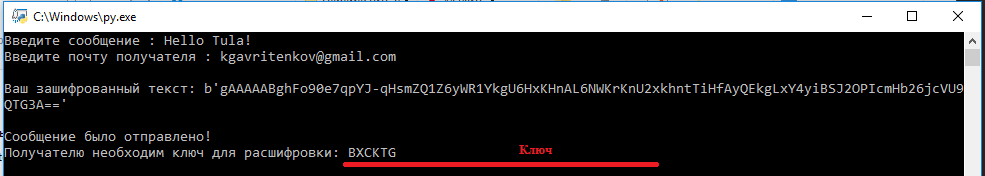
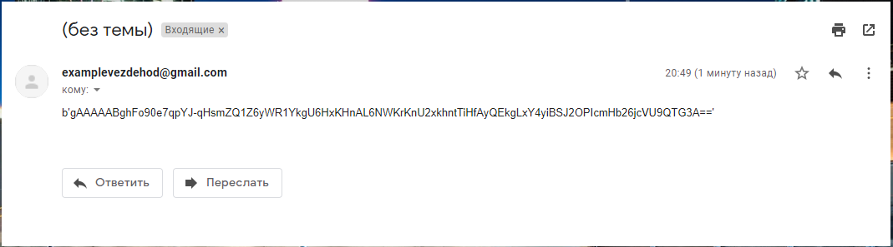
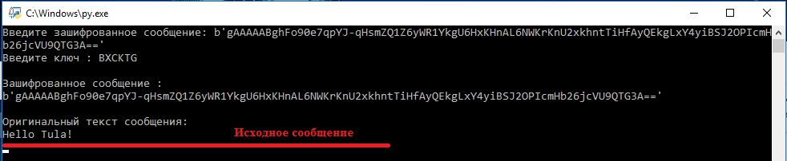

# Сервис обмена зашифрованными сообщениями
## 1. Импортируйте модули

```sh
pip install string smtplib random urllib.request cryptography base64
```
## 2. Отправка сообщения
### Запустите send.py

- Введите сообщение (__латиница__)
- Введите почту получателя


После этого в командой строке будет указан ключ для расшифровки.
__Сохраните ключ__.
На почту получателя придет текст в зашифрованном виде.

## 3. Расшифровка сообщения с помощью ключа
### Запустите receive.py
- Введите зашифрованное сообщение
- Введите ключ

После этого в командой строке будет показано исходное расшифрованное сообщение.
## Скриншоты работы программы:
#### Отправка сообщения на почту

#### Получение письма на почте

#### Расшифрока с помощью ключа


